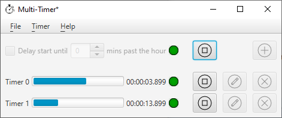

# The Quatinus Multi-Timer Application

Quatinus Multi-Timer is a simple cross-platform graphical timer application that supports multiple concurrent timers. The application is written in Java using the JavaFX GUI library; it stores timer definitions in JSON-format disc files. The project mainly targets Microsoft Windows 10 and provides a Windows MSI installer package, but the code should be readily adaptable to run on other operating systems supported by Java and JavaFX.

## Licensing

Quatinus Multi-Timer is Free Open Source Software licensed under the [GNU General Public License version 3](LICENCE.md).

## Building the Application

The source code is hosted on [GitHub](https://github.com/demonfiddler/multi-timer). For build instructions, see this [separate document](BUILDING.md).

## Installing the Application

For installation instructions, see this [separate document](INSTALLING.md).

## Launching the Application

Once installed, the product may be launched from the Windows Start menu under Multi-Timer 1.0 > Multi-Timer 1.0:

## Using the Application

When first launched, the main application window looks like this:
 

There are no timers defined at first.

### Adding a Timer

Clicking the add button  adds the first timer and shows the timer edit dialogue:

Set the required values:

Field|Type|Description  
-----|----|-----------  
Name|String|The timer name to be shown in the main application window  
Interval|Temporal Duration|The number of hours, minutes and seconds for which the timer should run  
Warn after|Temporal Duration|The number of hours, minutes and seconds after which the running timer should show an amber warning status light  
Auto-repeat|Yes/No|Whether the timer should repeatedly cycle once started  

Note: If non-zero, Warn after should be less than Interval (use zero for no warning).

When you press the OK button, the updated timer values are copied to the main window:

To add another timer, simply repeat the above process to get:

Note that each timer displays its interval in hours, minutes and seconds.

### Starting & Stopping the Timers

You can start each timer individually using its start button  (which changes to a stop button  once the timer is running).

You can start all timers together by pressing the main start button  (which similarly changes to a main stop button when one or more timers are running).

When all timers are running, the application window looks something like this:

Note that the red circles  have now changed to green , to indicate that the timers are now running. When a timer has run past its 'Warn after' interval, the green circle changes to amber , to indicate that it is now in its warning period.

Also note that each running timer continually updates its 'time remaining' in hours, minutes, seconds and milliseconds.

Once all timers are complete, their progress bars show complete and their status lights change back to red:

### Delaying the Start

It is possible to delay starting the timers until a specified number of minutes past the hour. To do this, select the Delay start until check-box and specify the required number of minutes past the hour:

When you start the timers together in delayed mode using the main start button, they enter a waiting state (status lights amber) until the current time matches the specified number of minutes past the hour. If the current time is already later than that number of minutes past the current hour, the application waits until the specified number of minutes past the *next* hour. Here, the timers are waiting to start exactly on the next hour:

Then, exactly at the appointed time (on the next hour in this example), the timers all start together:

### Saving the Timers

Once you have configured your set of timers, you can save them to a disc file. Timer files have the file extension .timers, although the extension may not or may not be visible in Windows Explorer, depending on the Explorer's 'Hide extensions for known file types' Advanced Setting:

To save a set of timers, execute the File > Save command from the main pull-down menu:  
 or use the accelerator key combination Ctrl+S.

The first time you do this for a new set of timers, the application presents a File Save As dialogue for you to choose a folder and supply a file name. It is not necessary to type in the .timers extension; this will be added automatically if you leave it off:

Press the Save button and your timer set will be written to the folder and file specified. Once you do this, the main application window title will be updated to show the file name:

The second and subsequent times that you execute File > Save, your timer settings will simply be written back to the same file that you chose the first time round, without a dialogue being shown. If you wish to save the timers under a different file or folder name, use the File > Save As... command:

 or use the accelerator key combination Ctrl+Shift+S.

### Closing the Current Timers File

When you have finished working with the current timer set, you can close the file by executing the File > Close command from the main pull-down menu:

 or use the accelerator key combination Ctrl+F4.

If you have unsaved changes, you will be prompted to save them.

Unless you cancel this dialogue, the application window will end up looking like this:

Note that all controls are disabled, because there is no current timers object open.

### Opening a Timers File

#### From the Application

To open a previously saved timers file from within the Multi-Timer application, execute the File > Open... command from the main pull-down menu:

 or use the accelerator key combination Ctrl+O.

If you have unsaved changes, you will be prompted to save them. Unless you cancel the dialogue, the application shows a File Open dialog for you to choose the timers file to open:

Navigate to the folder containing the timers file, select the required file and press the Open button.

#### From Windows Explorer

To open a previously saved Multi-Timer file from Windows Explorer, navigate to the folder containing the file and either click/double-click on it (depending on your 'Folder Options > Click items as follows' Explorer option) or execute the Open command from the context menu (pops up when you right-click the file):

Either way, the application launches and opens the requested file:

